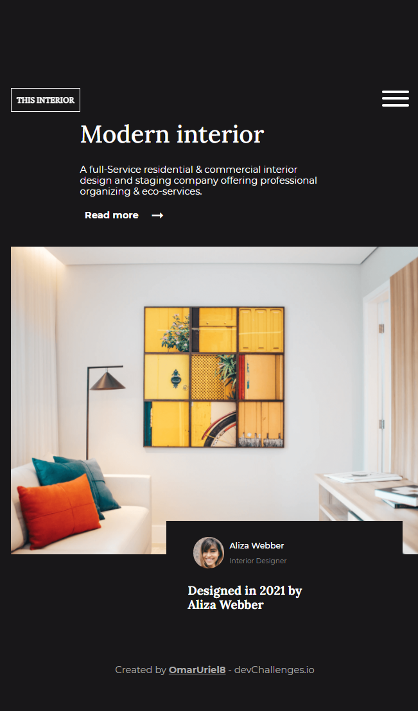

# Interior Consultant

---

## Tabla de contenido
---

- [Vista general](#vista-general)
- [Sobre el proyecto](#sobre-el-proyecto)
- [Recursos](#recursos)
- [Construido con](#construido-con)
- [Comó usarlo](#como-usarlo)

## Vista General

---

Para Desktop


Para Smartphone


## Sobre el proyecto

---

Diseño responsive de una diseadora de interiores

## Recursos

---

Este diseño fue construido en base al reto Interior Consultant del sitio [DevChallenge](https://devchallenges.io/challenges/Jymh2b2FyebRTUljkNcb).

El menú de hamburguesa fue hecho con la librería [Hamburgers](https://jonsuh.com/hamburgers/). La parte de este componente se encuentra en el archivo Header.jsx

## Construido con

---

- [Vite](https://vitejs.dev/guide/#scaffolding-your-first-vite-project)
- [React](https://es.reactjs.org/docs/getting-started.html)
- [Emotion](https://emotion.sh/docs/introduction)
- [Hamburgers](https://jonsuh.com/hamburgers/)

## Como usarlo

---

Comandos para la terminal

```bash
# Instalar dependencias
$ npm install

# Correr la app
$ npm run dev
```